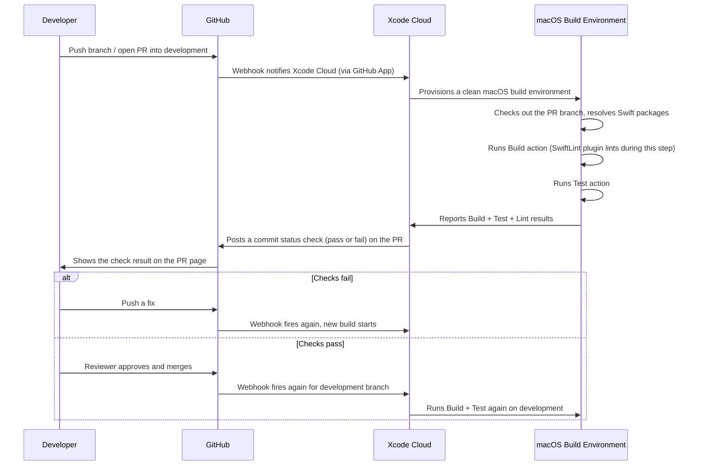

# Sonic Pals

Sonic Pals is an augmented reality (AR) game for iPhone. Using your
device's camera and LiDAR sensor, you explore your real room to learn about ultrasonic using sound-based "ping" scanning, complete simple quizzes,
and finish objectives along the way.

## What you need

- A Mac with Xcode 26 or later
- An iPhone with a LiDAR scanner (for the full AR experience, the
  app builds and runs without one, but the room-scanning features need it)
- An Apple Developer Program membership (for running on a real device and
  for App Store submission later)

## Opening the project

1. Clone this repository.
2. Open the `.xcodeproj` file in Xcode and let it fetch the Swift
   packages. If it asks whether to trust the SwiftLint plugin, say yes,
   it checks the code style on every build.
3. Under Signing & Capabilities, select your Apple Developer account.
4. Plug in a real iPhone and select it as the run destination.
5. Press the Run button or `Cmd+R`.

## Project structure

- `App/` — the app's entry point and shared app-wide state
- `Game/` — the actual gameplay logic, split by feature:
  - `Game/World/` — the core ECS (Entity-Component-System) engine driving
    the game
  - `Game/Scan/` — floor and room scanning
  - `Game/Reveal/` — progressively revealing the world as you explore
  - `Game/Target/` — spawning, finding, and guiding you to the hidden target
  - `Game/Mission/` — mission and quiz progress/scoring
  - `Game/Tutorial/` — onboarding/coaching hints for new players
- `Services/` — small standalone helpers (sound effects, haptics, AR session
  handling)
- `UI/` — all the SwiftUI screens, grouped by area (Home, Session/HUD, Quiz,
  Splash, and Shared reusable views)
- `Debug/` — developer-only tools, never included in release builds
- `Resources/` — audio files
- `Assets.xcassets/` — images and the app icon

Alongside the app folder:

- `Packages/SonarCore/` — the ultrasonic simulation as plain Swift, no
  RealityKit or ARKit, so it can be tested without a device
- `Packages/RealityKitContent/` — the 3D models for the tree and mango
- `Documentations/` — this README's companion notes

See `Documentations/ARCHITECTURE.md` for a deeper look at how these pieces
fit together.

## Running the tests

1. Pick any iPhone Simulator as the run destination, a real device isn't
   needed just to run the tests (see note below).
2. Press `Cmd+U`, or open the Test Navigator (flask icon, `Cmd+6`) to run
   individual tests.

Note: the automated tests are written so they don't need a live camera
session, so a Simulator is enough to run them, even though the actual game
needs a real device to play properly.

## PR + Development Gate Pipeline

## Credits

**Art Direction & World Building:** Rio Ardi Ferdian, Michelle Gravielle
Benedicta Roring

**Technical Direction & AR Space:** Shanon Giuly Istanto, James Richard
Renaldo, Jayvin Tiya Silo
